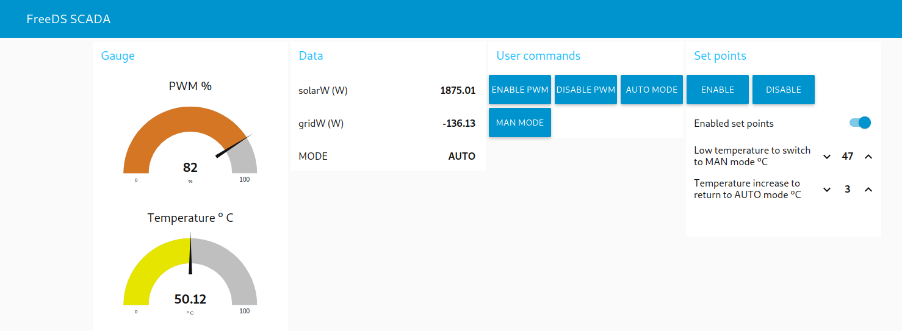

<a href="https://www.buymeacoffee.com/rbpiuserf" target="_blank"></a>

# FreeDS-SCADA (Pyhon script added, work in progress, use for testing purposes only)
FreeDS SCADA developed using Node-Red

#### Project objectives
This project implements a SCADA for FreeDS, developing these functions:
- shows information about FreeDS status
- allows enable/disable PWM and switching modes AUT<-->MAN
- implements two set points in order to switch to MAN mode when the temperature is <= Low_temperature_set_point and switches to AUTO mode when the temperature is >= Low_temperature_set_point+Temperature_increase_set_point

#### Requeriments
1. A Raspberry Pi, I'm using a Raspberry Pi 2 and a 16 GB SD card
2. Raspberry Pi administration skills
3. Install and configure Mosquito MQTT broker and required utilities:<br>
https://randomnerdtutorials.com/how-to-install-mosquitto-broker-on-raspberry-pi/
```
sudo apt install mosquitto mosquitto-clients screen
```
Edit /etc/mosquitto/mosquitto.conf and add at the end:
```
allow_anonymous true
listener 1883 0.0.0.0
```
Enable and restart Mosquitto:
```
sudo systemctl enable mosquitto.service
sudo service mosquitto restart
```
4. Install Node-Red:<br>
https://nodered.org/docs/getting-started/raspberrypi
```
bash <(curl -sL https://raw.githubusercontent.com/node-red/linux-installers/master/deb/update-nodejs-and-nodered) 
sudo systemctl enable nodered.service
sudo service nodered restart
```
Access to Node-Red from a Internet browser:<br>
http://raspberry-pi-IP:1880<br>
http://raspberry-pi-IP:1880/ui (runtime)<br>

5. Optional but recommendable:
- download MQTT explorer in order to debug MQTT broker: http://mqtt-explorer.com/
- configure your timezone and enable time synchronization:<br>
raspi-config --> Localisation Options --> Timezone
```
sudo raspi-config
sudo systemctl enable systemd-timesyncd
```

6. Log into Node-Red using http://raspberry-pi-IP:1880 and install node-red-dashboard:<br>
Menu-->Manage Palete-->Install and search node-red-dashboard, select it for installation and accept

7. Download <a href="FreeDS.py" target="_blank">FreeDS.py</a> and run it in a screen session

8. Download <a href="FreeDS-SCADA.json" target="_blank">FreeDS-SCADA.json</a>, import it into Node-Red and enjoy !


