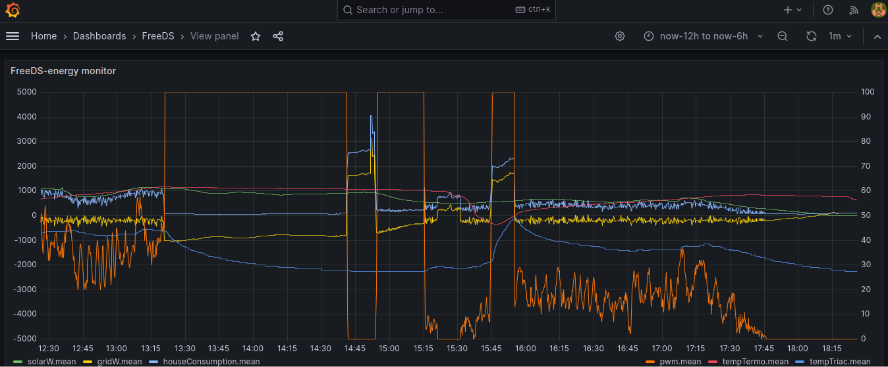

<a href="https://www.buymeacoffee.com/rbpiuserf" target="_blank"></a>

Last update: 2024/02/05
- Python script removed, all the logic is implemented using Node-RED
- MQTT data is stored InfluxDB
- Shelly EM integration
- Grafana can be used to display trends
- minor fixes and improvements

# FreeDS-SCADA
FreeDS SCADA developed using Node-RED




#### Project objectives
This project implements a SCADA for FreeDS, developing these functions:
- shows information about FreeDS status
- allows enabling/disabling PWM and switching between modes AUT<-->MAN
- implements two set points in order to switch to MAN mode when the temperature is <= Low_temperature_set_point and switches to AUTO mode when the temperature is >= Low_temperature_set_point+Temperature_increase_set_point

#### Requeriments
1. A PC or Raspberry Pi, I'm using a Raspberry Pi 2 and a 16 GB SD card
2. Debian or Raspberry Pi OS administration skills
3. Install and configure Mosquito MQTT broker and required utilities:<br>
https://randomnerdtutorials.com/how-to-install-mosquitto-broker-on-raspberry-pi/
```
sudo apt install mosquitto mosquitto-clients influxdb influxdb-client
```
Edit /etc/mosquitto/mosquitto.conf and add at the end:
```
allow_anonymous true
listener 1883 0.0.0.0
```
Enable and restart Mosquitto:
```
sudo systemctl enable mosquitto.service
sudo service mosquitto restart
```
4. Install Node-RED:<br>
https://nodered.org/docs/getting-started/raspberrypi
```
bash <(curl -sL https://raw.githubusercontent.com/node-red/linux-installers/master/deb/update-nodejs-and-nodered) 
sudo systemctl enable nodered.service
sudo service nodered restart
```
Access to Node-RED from a Internet browser:<br>
http://raspberry-pi-IP:1880<br>
http://raspberry-pi-IP:1880/ui (runtime)<br>

5. Create FreeDS database on InfluxDB:<br>
```
$ influx
> create database FreeDS
> quit 
```

6. Optional but recommendable:
- download MQTT explorer in order to debug MQTT broker: http://mqtt-explorer.com/
- configure your timezone and enable time synchronization:<br>
raspi-config --> Localisation Options --> Timezone
```
sudo raspi-config
sudo systemctl enable systemd-timesyncd
```

7. Log into Node-RED using http://raspberry-pi-IP:1880 and install node-red-dashboard/node-red-contrib-influxdb/node-red-contrib-filesystem:<br>
Menu-->Manage Palete-->Install and search node-red-dashboard/node-red-contrib-influxdb/node-red-contrib-filesystem, select it for installation and accept

8. Download <a href="FreeDS-SCADA.json" target="_blank">FreeDS-SCADA.json</a>, import it into Node-RED and enjoy !
